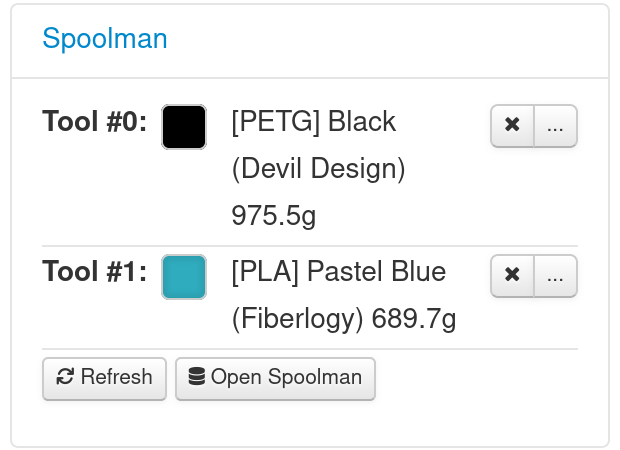
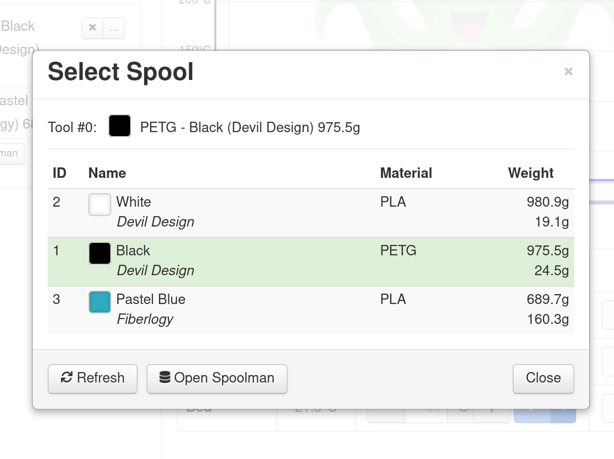

# octoprint-spoolman

An OctoPrint plugin integrating with [Spoolman](https://github.com/Donkie/Spoolman/), a universal filament spools inventory manager.

## ToC

- [Features](#features)
- [Setup](#setup)
- [Screenshots](#screenshots)
- [Development](#development)
- [Distributing](#distributing)

## Features

- [x] Basic Spoolman integration
    - [x] Connect to configured Spoolman instance
    - [x] Display available spools
        - By default, `archived` spools are not presented for selection
    - [x] Select & deselect spools for specified tools / extruders
    - [x] Commit spools usage to Spoolman
- [ ] Spools filtering
- [ ] Check spools before starting a print
    - [ ] Ask the user if the selected spool is correct
    - [ ] Warn when no spool is selected
    - [ ] Warn when selected spool does not have enough material
    - [ ] Warn when wrong spool material has been selected (PrusaSlicer / OrcaSlicer gcodes)

## Setup

Install via the bundled [Plugin Manager](https://docs.octoprint.org/en/master/bundledplugins/pluginmanager.html)
or manually using this URL:

    https://github.com/mdziekon/octoprint-spoolman/archive/master.zip

## Screenshots

### Selected spools list



### Spools' list



## Development

You can use `docker compose` to start a development server, consisting of a test OctoPrint & Spoolman instances.

_Note: the following steps have been tested on Linux-based OS. For Windows or MacOS - your mileage may vary._

### Start the development server

```bash
docker compose up
```

### Setup

On initial spin-up, you'll need to manually change permissions of the Spoolman directory:

```bash
# While in root directory of the project...
sudo chown 1000:1000 ./docker-data/spoolman
```

On first setup, you should configure your test Octoprint & Spoolman instances.

For Octoprint, there's currently no backup & restore method (problems with dockerized Octoprint not allowing to restore from backup), so you'll have to configure your instance manually (once).

For Spoolman, there's currently no backup & restore method, so you'll have to create spools manually.

### Development

You can use `docker compose` to start a development server, consisting of a test OctoPrint & Spoolman instances.

```bash
docker compose up
```

### App locations

- Octoprint should be available at `localhost:7180`.
- Spoolman (outside of Docker) should be available at `localhost:7181`.
- Spoolman (inside Docker) should be available at `http://spoolman:8000`.
    - This is the value you should paste into Spoolman plugin's settings in Octoprint.
- Data used by Docker containers is stored in `docker-data` folder.

#### Protips

- After applying any changes to the plugin's code, restart the Octoprint server so that it picks up your changes.
- You can place Octoprint's code in `octoprint_Spoolman/octoprint` directory.
    - This helps with some autocompletions, mostly in places where we're using Octoprint's shared APIs.
    - Don't worry about polluting git repo - this folder has been added to `.gitignore` already.

## Distributing

### Zip folder method (manual)

```bash
zip -r octoprint-spoolman.zip octoprint-spoolman -x "**/.git/*" "**/docker-data/*" "**/octoprint_Spoolman/octoprint/**" "**/__pycache__/*"
```
